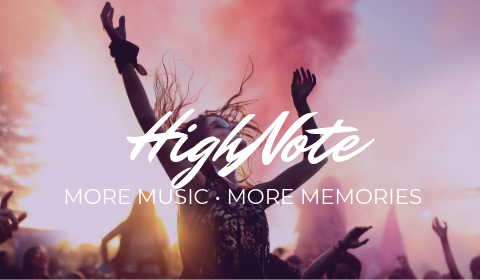
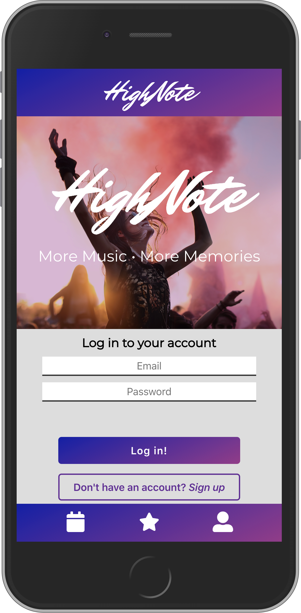
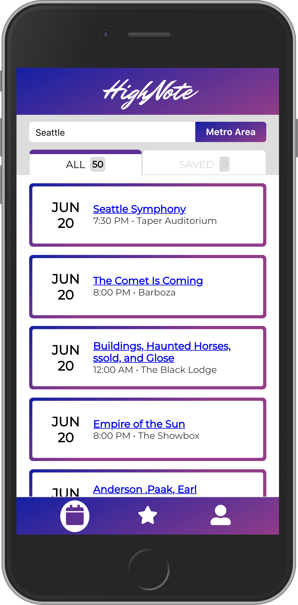
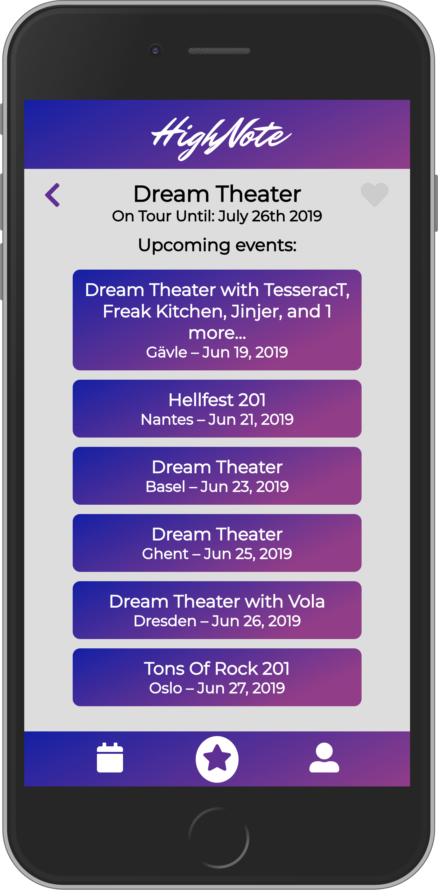

# ga-wdi23-project-4

General Assembly Web Development Immersive - Project 4

# HighNote Event Discovery Mobile Web App

## Carlo Bruno | General Assembly Web Development Immersive

### Project \#4 Full Stack Application - React GraphQL Node.js Express MongoDB

[LIVE DEMO](https://highnoteapp.herokuapp.com/)

## Table of Contents

- [Introduction](#introduction)
- [Building the App](#building-the-app)
- [Built With](#built-with)

## Introduction

> “Without music to decorate it, time is just a bunch of boring production deadlines or dates by which bills must be paid.”

> ― Frank Zappa, Musician

HighNote is a full-stack mobile web app created for people who want to have readily accessible information about music events in their metro area. HighNote also keeps track of their favorite artists' upcoming events.

### Project Specification

This is Portfolio Project 4 of General Assembly Web Development Immersive. The goal is to create a Full-Stack Web App of our chosing. We have the freedom to chose technologies we are comfortable with, or challenge ourselves to learn new things. I chose the latter, and implemented GraphQL for this project.

### Technical Requirements

- Use Django or Express to build an application backend
- Create an application using at least 2 related models, one of which should be a user
- Include all major CRUD functions for at least one of those models
- Create your own front-end! Put effort into your design!
- Add authentication/authorization to restrict access to appropriate users
- Manage team contributions and collaboration using a standard Git flow on Github
- Layout and style your front-end with clean & well-formatted CSS, with or without a framework.
- Deploy your application online so it's publicly accessible

#### HighNote Screenshot

## Building the App

### Future Implementation

First feature I would love to implement is a map view of a venue. I want our users to have all the information that they need without consulting other sites or switching to different apps.

I also would like to have the Events and Artists mini cards to be clickable, linking them to more specific information about them.

Another thing is a better implementation and mastery of GraphQL. I believe that the infrastructure I have implemented, although working, can be further improved. I enjoyed the challenge of learning and building in GraphQL, and was amazed with what it can do!

#### Disclaimer, Credits:

## Built with

- [GraphQL](https://graphql.org/)
- [Moment.js](https://momentjs.com/)
- [SongKick API](https://www.songkick.com/developer/upcoming-events-for-artist)
- Google Fonts [Montserrat](https://fonts.google.com/specimen/Montserrat) &
  [Mr Dafoe](https://fonts.google.com/specimen/Mr+Dafoe)
- [FontAwesome Icons](https://fontawesome.com/)
- [Brand Image](https://unsplash.com/photos/yX-TbOWv2C4)

### Tutorials, Ideas and Inspiration

- [GraphQL Tutorial](https://graphql.org/learn/)
- [GraphQL Basics](https://youtu.be/lAJWHHUz8_8) by [MPJ](https://twitter.com/mpjme), Fun Fun Function
- [Build a Project with GraphQL, Node, MongoDB and React.js](https://www.youtube.com/playlist?list=PL55RiY5tL51rG1x02Yyj93iypUuHYXcB_) by [Maximilian](https://twitter.com/maxedapps), Academind
